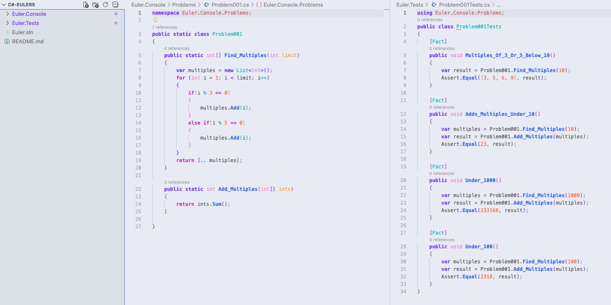

Looking at job postings has left me deflated. I am attempting to find something to feel confident about in ever posting that I see. Working hard at learning Clojure and system architecture over the last year has been great and so I need to convey my abilities in these areas. After coming accross yet another post that requires some knowledge of C# or .NET, I decided to try it out again. Years ago after completing my bootcamp I felt very lost. I decided to try C# by creating a Blazer to-do app. This time around I wanted to try something simple to get the hang of the project structure as well as testing so a new Euler project was born. 

Getting a C# project setup seems to be a hassle in itself. The whole structure feels very foreign, having multiple 'projects' inside of a single project container and using a .sln file to relate these .csproj's. I'm not sure if this is because I am using VSCode rather that VS itself, I assume that there are simple project creation menus that I don't have access to. This is okay though because it forced me to use the CLI for creating and setting up the projects.

For example just setting up this simple project with a 'console' and 'test' project I used dotnet commands:

```
dotnet new sln -n {Project name} --format sln
dotnet new console -n {Project name}.Console
dotnet new xunit -n {Project name}.Tests
dotnet sln Euler.sln add {Project name}.Console/{Project name}.Console.csproj
dotnet sln Euler.sln add {Project name}.Tests/{Project name}.Tests.csproj
dotnet add Euler.Tests reference Euler.Console/Euler.Console.csproj
dotnet test
```

After spending some time getting this structure right I was able to get a failing unit test, success!! Only a few minutes later I was able to have my first working program, Euler problem 001 complete!

**